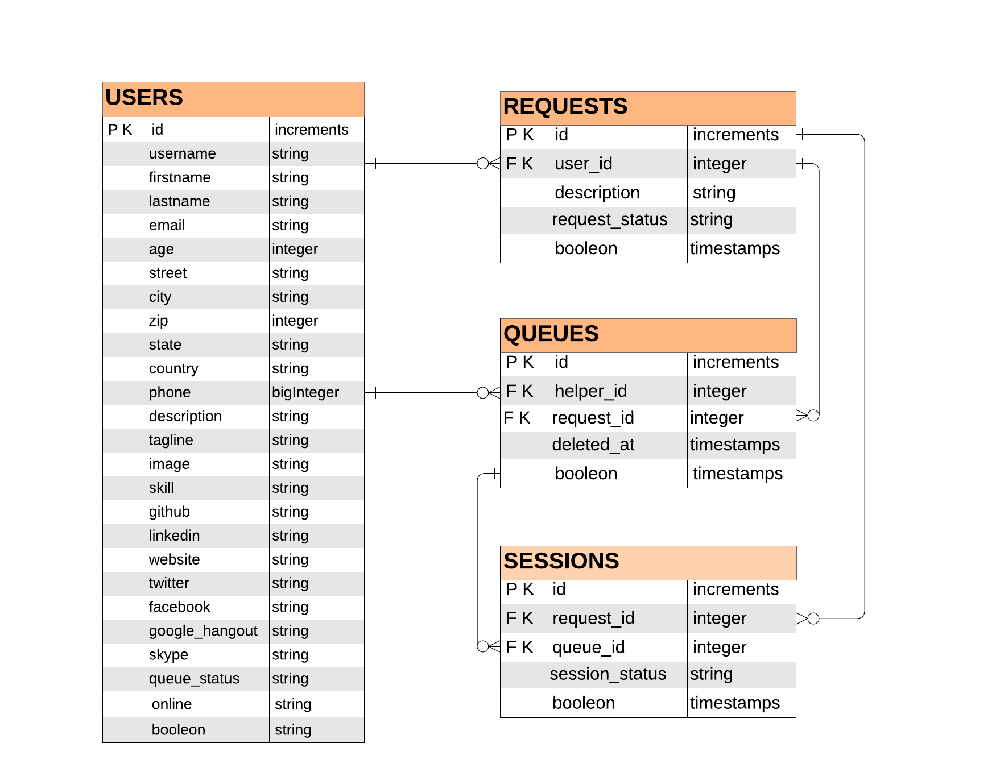

# Instant Help

This project is designed bring together developers so they can connect and help each other in real time. Simply create a user profile to offer help or request help within the developer community. 

Caution: Insta Help is deployed using Heroku. Heroku serevers will sleep if left unused. If Heroku Servers are asleep they will activate shortly. Estimated time to activate 30 seconds.  

takes a moment to activate initially servers maybe asleep and will activate within a short time.  

### Demo Link 
https://instahelp1.herokuapp.com/

Table of Contents
  - [Features](#Features)
    - [Request Help](#Request-Help)
    - [Offer Help](#Offer-Help)
  - [User Walk Through](#User-Walk-Through)
    - [Request Help](#Request-Help)
    - [Offer Help](#Offer-Help)
  - [Install and Setup](#Install-and-Setup)
  - [Deploy via Heroku](#Deploy-via-Heroku)
  - [Database Schema](#Database-Schema)
  - [Project Status](#Project-Status)
  - [Technologies](#Technologies)
  - [Author](#Author)
  - [Contributions](#Contributions)
  - [License](#License)

### Features
#### Request Help
#### Offer Help

### User Walk Through
#### Request Help
#### Offer Help


### Install and Setup
```
Step 1.
Within GitHub fork both front and back GitHub repos – creates GitHub links to clone local repos.


Step 2.
Open terminal.

Step 3. Create project folder
mkdir temp_project – makes your project folder. Feel free to use a different folder name.
cd temp_project – navigates into the newly created folder.
```
###### Back End

```
Step 4. Backend Folders
mkdir temp_project_backend – makes the backend folder.
cd temp_project_backend – navigates into the new backend folder.

Step 5. Clone local backend repo and install dependencies
git clone https://github.com/ChrisIhler/instant-help-backend.git
cd instant-help-backend – navigates into the new backend repo folder.
npm install – installs Node dependencies.

Step Optional.
if you want to use the seeded data within PostgreSQL run the following.
npm run knex seed:run – creates predefined users so you don’t have to create your own. 

Step 5. Start or close backend server
npm run start – starts the backend Server
npm run dev - start backend Server with Nodemon
control C - closes server
```
###### Front End

```
Step 4. Frontend Folders
Caution: make sure your terminal is within the project folder
mkdir temp_project_frontend – makes the frontend folder.
cd temp_project_ frontend – navigates into the new frontend folder.

Step 6. - Clone local frontend repo
git clone https://github.com/instant-help/instant-help-frontend
cd instant-help-frontend

Step 7. Start or close frontend server
Caution: First make sure the backend server is up and running so the frontend works properly. 
npm install – installs Node dependencies
npm run start – starts the front-end server
control C - closes server
```

### Deploy via Heroku

Deploy Backend First

You will need to get the PostgreSQL server installed and running. Below is a link to 
Heroku instructions that I personally used. 

Link:  https://codeselfstudy.com/blog/deploy-node-postgres-heroku/

###### Back End
```
Step 1. 
Navigate to the backend project folder.

Step 2. 
heroku create – This command will start the Heroku project and provided a project URL for the Backend. 
Caution: you will need this backend URL to past in the frontend .env.production file later. 

Step 3.
heroku addons:create heroku-postgresql:hobby-dev – This command will add a PostgreSQL database to your backend project. You will be given a name for your PostgreSQL database and need to copy that into the next command. 

Step 4. 
heroku pg:credentials:url <place PostgreSQL database name here> - This command will give you a very long Connection URL that you will need to copy for then Heroku configuration. 

Step 5. 
heroku config:set DATABASE_URL=<place Connection URL Here> - Your database is now setup.
heroku config:set SECRET=makemoneyhelpingpeople – This configuration will allow user authorizations to function. 

Step 6.
git push heroku master – to push these changes to Heroku

Step 7.
heroku run knex migrate:latest – this starts the Heroku database.

Step 8. 
heroku run knex seed:run – this will run the database seeds to generate users automatically.

Step 9. 
heroku open – The database is ready to receive Http requests. 
```
###### Front End
```
Now it is time to setup and deploy the front end. I used the link below as a reference. 

Link: https://elements.heroku.com/buildpacks/mars/create-react-app-buildpack

Step 1. 
Navigate to the .env.production file within the Front end project. Then replace the REACT_APP_API_URL=< new url > with the new backend URL. 
Example: REACT_APP_API_URL=https://quiet-spire-47828.herokuapp.com 

Step 2. 
Git add . – adds all new changes to git
Git commit -m “name of commit message” – commits the new changes so they can be pushed to heroku

Step 3.
heroku create <Name you want to Use for the Front End> --buildpack mars/create-react-app

Step 4.
git push Heroku master – pushes the new URL change to heroku

Step 5.
heroku open – you should now be able to sign up or log in. test login Username: 1 Password: a if the database was seeded. 
```

### Database Schema
 

### Project Status

This project is occasionally maintained and improved. Users can expect improvements upon the look and feel of the app plus additional features over time. Requests for additional features at ihlerconsulting@gmail.com with the subject “Instant Help App”.

### Technologies

###### General
-	JavaScript - The coding language
-	Node – JavaScript package ecosystem
-	Axios - Promise based HTTP client for the browser and node.js

###### Back End

-	Express.js - A Node.js web application framework that provides a robust set of features for web and mobile applications
-	JWT JSON Web Token - open, industry standard RFC 7519 method for representing claims securely between two parties.
-	Cors - Cross-Origin Resource Sharing (CORS) is a specification that enables truly open access across domain-boundaries.
-	postgreSQL - An object-relational database management system
-	Knex.js - SQL query builder for PostgreSQL databases
-	Uuid - Simple, fast generation of unique ids.
-	Bcrypt - A library to help you hash passwords.
-	Morgan- HTTP request logger middleware for node.js
-	Nodemon - a utility that will monitor for any changes in your source and automatically restart your server.

###### Front End

-	React - A JavaScript library for building user interfaces
-	Redux - A Predictable State Container for JS Apps
-	React Redux - Official React bindings for Redux
-	React Router - Declarative routing for React
-	Redux Thunk – Middleware for Redux
-	Bootstrap - The css framework used
-	Heroku - A cloud platform to deploy your apps, whether front-end or backend.
-	HTML 5 - Markup language for documents designed to be displayed in a web browser.
-	CSS 3 -  style sheet language used for describing the presentation of a document written in a markup language like HTML
-	Font Awesome – Web based icon set and toolkit.

### Author
###### Chris Ihler

### Contributions
Contact Instant Help using ihlerconsulting@gmail.com with the subject “Instant Help App” to begin contributing to this project

### License
This project is licensed under the MIT License 
